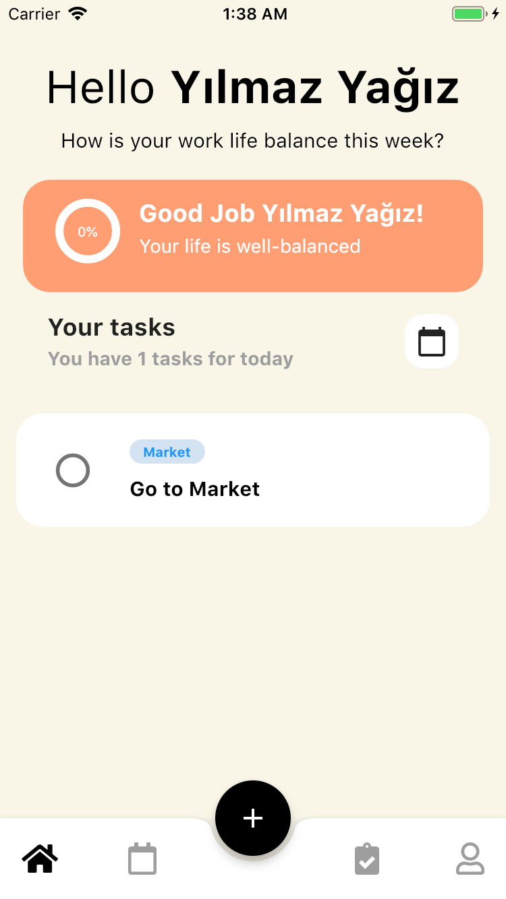
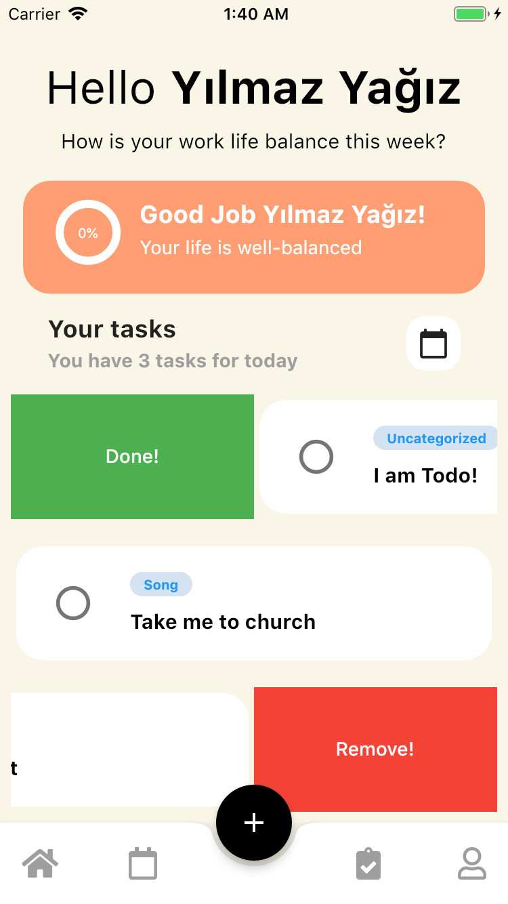
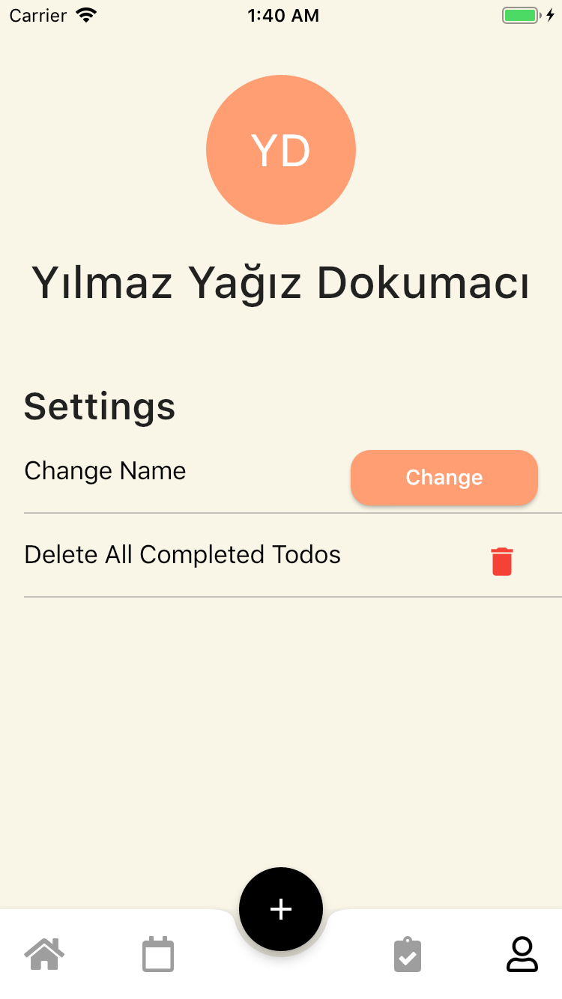

# Flutter - Todo App

Todo App I made with Flutter.

Desing : https://dribbble.com/shots/8935948-Work-life-Balance-app

#### Google Play
   <a href='https://play.google.com/store/apps/details?id=com.yagizdokumaci.todo_app&pcampaignid=pcampaignidMKT-Other-global-all-co-prtnr-py-PartBadge-Mar2515-1'>
   </a>

## Run Locally

Clone the project

```bash
  git clone https://github.com/yagizdo/Todo-Moon
```

Go to the project directory

```bash
  cd Todo-Moon
```

Install dependencies

```bash
  flutter pub get
```

Run App

```bash
  flutter run
```


## What will be add :question:

- [x] Dynamic Todos
- [x] HomePage UI
- [X] Add Todo Page
- [x] Shared Preferences for Add Todo Page
- [x] State Management (Provider)
- [ ] Dark Mode
- [x] Splash Screen


##  Libraries I use in the application:
- Provider : https://pub.dev/packages/provider
- Shared Preferences : https://pub.dev/packages/shared_preferences
- Slidable : https://pub.dev/packages/flutter_slidable
- Font Awesome Flutter : https://pub.dev/packages/font_awesome_flutter
- Hex Color : https://pub.dev/packages/hexcolor
- Percent Indicator : https://pub.dev/packages/percent_indicator
- Flutter Toast : https://pub.dev/packages/fluttertoast
- Flutter Launcher Icons : https://pub.dev/packages/flutter_launcher_icons
- Modal Bottom Sheet : https://pub.dev/packages/modal_bottom_sheet
- Flutter Native Splash : https://pub.dev/packages/flutter_native_splash


## App Video

Uploading Simulator Screen Recording - iPhone 7 - 2022-03-16 at 02.12.43.mp4…


## Screenshots

### Splash Screen


### Homepage



### Description


### Add Todo


### Dashboard


### Profile



## Contributing

Contributions are always welcome!
